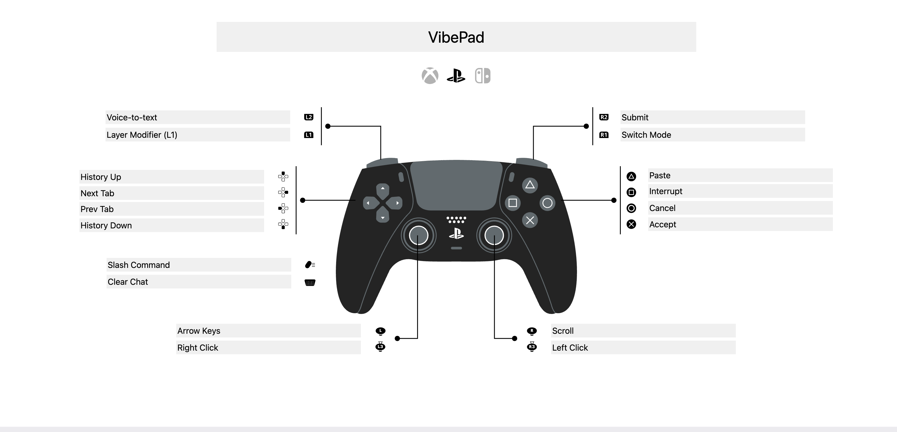
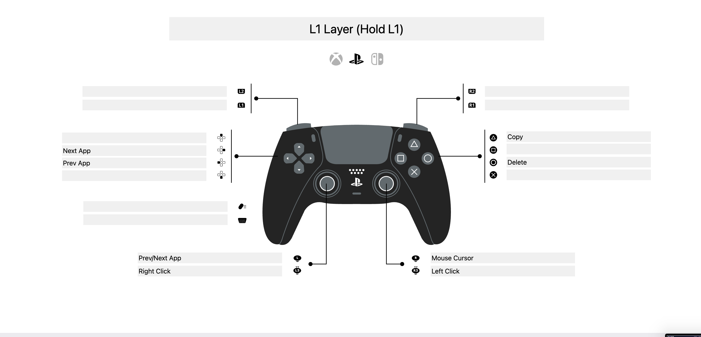

# VibePad

> 🛋️ Ship code from your couch. Control your AI coding assistant with a gamepad 🎮

A lightweight macOS menu bar app that maps gamepad inputs to keyboard shortcuts optimized for AI-assisted development in VS Code, Cursor, and terminal.

## Features

- **Smart Paste** — clipboard-aware: sends Ctrl+V for images (Claude Code terminal), Cmd+V for text
- **Two-layer mapping** — default layer + L1 modifier layer doubles your button count
- **Sticky modifiers** — L1+D-pad app switching holds Cmd across multiple presses, releases on L1 up
- **Left stick → arrow keys** — with hysteresis thresholds and hold-to-repeat
- **Right stick → scroll** — continuous smooth scrolling in any direction
- **L1+left stick → app switch** — flick right for next app, left for previous
- **L1+right stick → mouse cursor** — move the mouse pointer with the right stick
- **Hold-to-repeat** — configurable per-button repeat delay and interval
- **Trigger modes** — fire on press, release, or both (e.g. hold-to-talk for voice input)
- **HUD overlay** — learning mode shows action labels on every button press
- **Menu bar app** — status icon, enable/disable toggle, launch at login
- **JSON config** — full customization of mappings, descriptions, stick tuning at `~/.vibepad/config.json`
- **Native controller support** — PS5 DualSense, Xbox, and MFi via GameController framework

## Button Mapping

> [View interactive layout on PadCrafter](https://www.padcrafter.com/index.php?templates=VibePad%7CL1%20Layer%20%28Hold%20L1%29&leftTrigger=Voice-to-text&rightTrigger=Submit&leftBumper=Layer%20Modifier%20%28L1%29&rightBumper=Switch%20Mode&aButton=Accept&bButton=Cancel%7CDelete&xButton=Interrupt&yButton=Paste%7CCopy&dpadUp=History%20Up&dpadDown=History%20Down&dpadLeft=Prev%20Tab%7CPrev%20App&dpadRight=Next%20Tab%7CNext%20App&leftStickClick=Right%20Click%7CRight%20Click&rightStickClick=Left%20Click%7CLeft%20Click&startButton=Slash%20Command&backButton=Clear%20Chat&leftStick=Arrow%20Keys%7CPrev%2FNext%20App&rightStick=Scroll%7CMouse%20Cursor)

### Default Layer



### L1 Layer (Hold L1)



## Custom Mappings

VibePad writes its default config to `~/.vibepad/config.json` on first launch. Edit this file to customize your layout, then restart the app.

```json
{
  "version": 1,
  "profile": "claude-code",
  "mappings": {
    "buttonA": { "type": "keystroke", "key": "return", "modifiers": [] },
    "buttonX": { "type": "keystroke", "key": "c", "modifiers": ["control"] },
    "buttonMenu": { "type": "typeText", "text": "/" }
  },
  "l1Mappings": {
    "buttonB": { "type": "keystroke", "key": "delete", "modifiers": [] }
  },
  "stickConfig": {
    "leftStickDeadzone": 0.3,
    "rightStickDeadzone": 0.2,
    "arrowPressThreshold": 0.5,
    "arrowReleaseThreshold": 0.3,
    "scrollSensitivity": 15.0
  }
}
```

### Action types

- **`keystroke`** — press a key with optional modifiers. `key` is any key name from the [key list](#available-keys), `modifiers` is an array of `"command"`, `"control"`, `"shift"`, `"option"`.
- **`typeText`** — type a string character by character. Use `\n` for Enter.
- **`smartPaste`** — clipboard-aware paste: sends Ctrl+V when the clipboard contains an image, Cmd+V otherwise. No `key` or `modifiers` needed.

### Available buttons

`buttonA`, `buttonB`, `buttonX`, `buttonY`, `dpadUp`, `dpadDown`, `dpadLeft`, `dpadRight`, `leftShoulder`, `rightShoulder`, `leftTrigger`, `rightTrigger`, `leftThumbstickButton`, `rightThumbstickButton`, `buttonMenu`, `buttonOptions`

Note: `leftShoulder` (L1) is reserved as the modifier layer key and cannot be remapped.

### Available keys

Letters (`a`-`z`), numbers (`0`-`9`), `return`, `escape`, `space`, `tab`, `delete`, `forwardDelete`, arrows (`upArrow`, `downArrow`, `leftArrow`, `rightArrow`), punctuation (`grave`, `minus`, `equal`, `leftBracket`, `rightBracket`, `backslash`, `semicolon`, `quote`, `comma`, `period`, `slash`), function keys (`f1`-`f12`).

## Requirements

- macOS 14 (Sonoma) or later
- PS5 DualSense, Xbox, or MFi controller
- Accessibility permission (for keyboard injection)

## Installation

1. Download the latest release
2. Move VibePad.app to Applications
3. Launch and grant Accessibility permission when prompted

## Tech Stack

- Swift 5.9+
- AppKit (menu bar app)
- GameController framework
- CGEvent for keyboard injection

## Acknowledgments

Inspired by [enjoy2](https://github.com/fyber/enjoy2) — a macOS joystick-to-keyboard mapper.

## License

[PolyForm Noncommercial 1.0.0](https://polyformproject.org/licenses/noncommercial/1.0.0/) — source available, non-commercial use permitted. See [LICENSE](LICENSE) for details.
